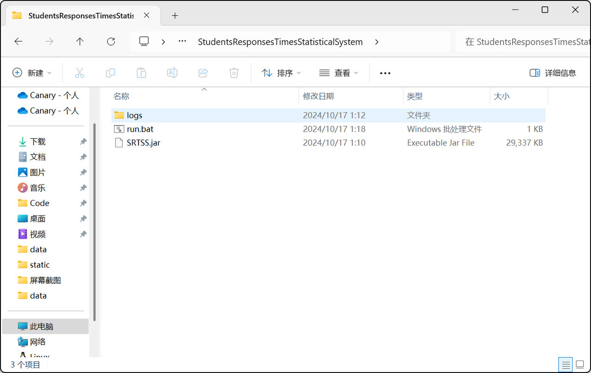
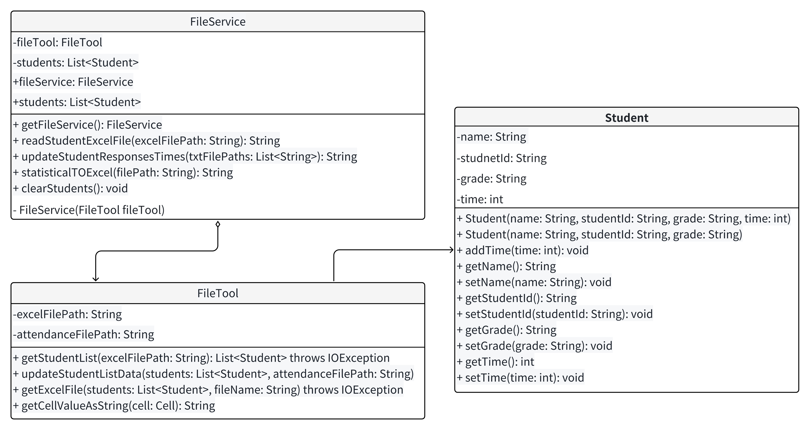

# StudentsResponsesTimesStatisticalSystem
——————StudentsResponsesTimesStatisticalSystem开发及部署文档

| 开发人：           | 张文博                     |
|:---------------|:------------------------|
| 开发时间：          | 2024.10.12--2024.10.17  |
## 一，项目部署
### 1.1 JDK版本
本项目开发环境为JDK17
### 1.2 使用流程
#### 1.2.1 解压后得到如图所示目录结构，双击run.bat即可运行

#### 1.2.2 项目运行时为如下情景

### 1.3 注意事项
#### 1.3.1 项目相关
- 运行时关闭终端窗口会使项目停止
- 不可修改，移动，破坏图一的目录结构，不然项目运行会报错
- 注意jdk版本为17才可正常运行
#### 1.3.2 使用相关
- 必须先导入学生信息Excel之后才可以给学生统计抢答次数
- 统计抢答次数文件可以多选，并且在一次读取之后，可以进行下一次读取，数据同样会记录在最终的表格中
- 传入的txt文件必须是UTF-8编码，不然会中文乱码识别不到
- 终端窗口会显示一些程序运行产生的数据，可以用于调试及问题反馈
- 图一中logs文件夹会保留程序运行的所有日志
## 二，开发文档
### 2.1 项目UML图

### 2.2 所用设计模式知识
#### 2.2.1 单例模式
  目的： 保证一个类仅有一个实例
  应用： 在 FileService 类中，单例模式确保了整个应用程序中只有一个 FileService 实例，控制文件操作的全局状态，确保只有同一时间只有一个可以操作文件，避免并行操作覆盖文件数据
#### 2.2.2 合成复用原则
  目的：实现代码复用
  应用：FileService 聚合 FileTool 从而复用FileTool中的有关文件处理操作的方法
### 2.3 特别声明
项目内图片及部分代码借鉴AI工具@智谱轻言
本项目使用Maven进行项目构建，其中Excel读取，处理，日志记录均使用成熟的java库，主要依赖如下：
````xml
<dependency>
  <groupId>org.apache.poi</groupId>
  <artifactId>poi-ooxml</artifactId>
  <version>5.2.3</version>
  </dependency>
<dependency>
  <groupId>org.projectlombok</groupId>
  <artifactId>lombok</artifactId>
  <version>1.18.30</version>
  <scope>provided</scope>
  </dependency>
<dependency>
  <groupId>org.apache.logging.log4j</groupId>
  <artifactId>log4j-api</artifactId>
  <version>2.17.1</version>
  </dependency>
<dependency>
  <groupId>org.apache.logging.log4j</groupId>
  <artifactId>log4j-core</artifactId>
  <version>2.17.1</version>
</dependency>
````